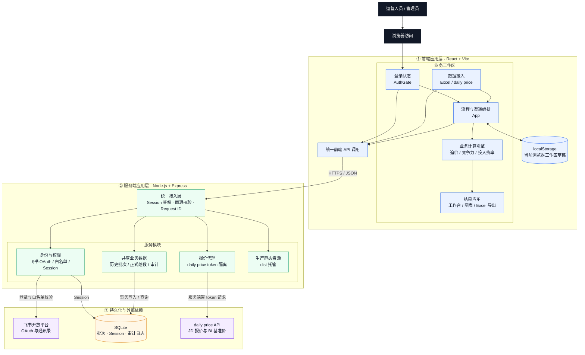

# 线上竞争追价系统

用于手机安卓回收业务的竞品追价测算、竞争力落数、历史趋势和竞争投入费率估算。系统以 `ppv` 为核心粒度，保留上传底表的原始字段，同时生成线上追价后的价格、利润、竞争力和投入费率结果。

## 功能范围

- 上传本次竞争追价表，作为当前工作台明细。
- 通过 daily price API 按 `ppv` 匹配 JD 最终报价和 BI 基准价。
- 上传补贴表，按新机系列和价格门槛动态匹配 AHS 投入与京东补贴。
- 按边际利润率底线或 `100%竞争力` 模式生成追价建议。
- 保存测算快照，并可确认当前批次为某一日期的正式竞争力落数。
- 展示历史竞争力趋势和历史快照。
- 计算本次竞争预估投入费用和两个投入费率。
- 导出包含原始字段和线上计算字段的追价表。

## 系统架构

### 架构定位

项目采用单仓库、前后端分层的 Web 架构：

- 浏览器端负责 Excel 解析、工作台草稿、追价计算、竞争力与投入费率计算、图表展示和 Excel 导出。
- Express 服务负责飞书登录、共享历史批次、正式竞争力落数、审计日志、daily price 代理，以及生产环境静态资源托管。
- SQLite 保存需要跨浏览器共享和长期追溯的数据；未保存的工作台草稿保存在当前浏览器的 `localStorage`。
- daily price 与飞书 OpenAPI 均由服务端访问，令牌和应用密钥不会进入前端构建产物。

这种划分让价格试算保持即时交互，同时把正式落数、权限和审计集中到服务端管理。

### 总体拓扑



### 分层与职责

| 层级 | 主要位置 | 职责 |
| --- | --- | --- |
| 页面与交互层 | `src/components/` | 数据上传、追价表格、竞争力图表、投入费率、历史批次、审计日志和新手引导。 |
| 应用编排层 | `src/App.tsx` | 管理京东换新/自营两个渠道的工作区状态，组合数据源，触发重算，保存批次并同步共享历史。 |
| 业务规则层 | `src/utils/` | 实现追价公式、补贴匹配、竞争力口径、小差额容忍、投入费率和动态 Excel 公式。该层不依赖页面组件。 |
| 类型与渠道配置 | `src/types.ts`、`src/config/channels.ts` | 定义产品、批次、补贴、费率等数据结构，以及不同渠道的竞品和费用口径。 |
| 前端 API 层 | `src/api.ts` | 封装登录状态、共享批次、批次迁移、软删除和审计日志请求。遇到未登录响应时触发重新登录。 |
| HTTP 服务层 | `server/index.mjs` | 注册 API、中间件和 daily price 代理；生产环境同时提供 `dist` 静态文件。 |
| 鉴权层 | `server/auth.mjs` | 完成飞书 OAuth、租户/部门/人员白名单校验、12 小时 Session、登录退出及鉴权审计。 |
| 持久化层 | `server/database.mjs` | 初始化 SQLite 表和索引，以事务保存、导入、降级或软删除历史批次，并维护 Session 和审计日志。 |

### 核心业务数据流

1. **身份校验**：`AuthGate` 读取 `/api/auth/config` 和 `/api/auth/me`。生产环境使用飞书 OAuth；本地开发可启用验收登录。
2. **载入工作区**：`App.tsx` 从 `localStorage` 恢复京东换新和自营渠道各自的上传数据、策略、手工价格与费率输入，同时从服务端拉取共享历史。
3. **导入基础数据**：`UploadSection` 在浏览器内解析竞争追价 Excel，转换成统一的 `Product`，并把全部源列保存在 `rawFields` 中。
4. **补齐价格数据**：前端把 PPV 发送到 `/api/daily-price/lookup`；Express 在服务端附加 token 并转发给上游，返回 JD 最终报价和 BI 基准价。
5. **匹配补贴与测算**：`App.tsx` 按 PPV 合并基础表和 daily price，再调用 `runBatchCalculations`。京东换新按新机系列和价格门槛匹配补贴，自营按通用价格门槛匹配 AHS 投入。
6. **应用人工策略**：手工追后价和小差额批量容忍通过同一套补贴、线性费用和边际利润逻辑重算，避免页面展示值与导出值采用不同口径。
7. **生成指标**：竞争力由 `competitiveness.ts` 按报价量加权，预计投入费用和费率由 `investment.ts` 按正向调价及近 30 天成交量计算。
8. **保存正式结果**：用户保存快照后，完整 `TrackingBatch` 写入 SQLite。若确认为某日正式竞争力落数，同渠道同日期的旧正式记录会在同一事务内降级。
9. **展示与导出**：历史、竞争力趋势和审计日志读取服务端数据；追价表和辅助表由浏览器使用 `xlsx` 生成，源字段继续随结果导出。

### 状态与数据边界

| 数据 | 保存位置 | 是否共享 | 说明 |
| --- | --- | --- | --- |
| 当前上传的基础表、补贴规则、daily price 结果 | 浏览器 `localStorage` | 否 | 属于当前浏览器工作区，按渠道压缩保存；上传文件本身不会传给服务端。 |
| 边际底线、追价模式、手工追后价、容忍底线、费率输入 | 浏览器 `localStorage` | 否 | 修改后立即影响当前工作区试算，尚未保存时不属于正式记录。 |
| 历史测算快照与正式竞争力落数 | SQLite `tracking_batches` | 是 | 保存时写入完整批次 JSON；服务端每 30 秒及页面重新可见时同步到浏览器。 |
| 登录会话 | SQLite `auth_sessions` + HttpOnly Cookie | 是 | 数据库存 token 哈希，浏览器只持有 Cookie；Session 默认有效期 12 小时。 |
| 操作审计 | SQLite `audit_logs` | 是 | 记录登录、批次创建/确认、历史迁移、软删除和失败操作。 |
| SQLite 文件 | `data/price-rival.sqlite` | 取决于部署磁盘 | Docker 使用 `./data:/app/data` 数据卷，更新容器时不会覆盖数据库。 |

首次连接服务端时，前端会尝试把浏览器中的旧历史批次迁移到 SQLite；批次 ID 已存在时跳过。成功同步后，服务端历史是页面历史记录的权威来源。

### API 边界

除鉴权入口外，`/api` 下的业务接口都必须存在有效 Session；写操作还会执行同源校验。

| 方法 | 路径 | 用途 |
| --- | --- | --- |
| `GET` | `/api/auth/config` | 查询飞书鉴权和本地验收登录是否可用。 |
| `GET` | `/api/auth/me` | 获取当前登录用户。 |
| `GET` | `/api/auth/login` | 发起飞书 OAuth 登录。 |
| `GET` | `/api/auth/feishu/callback` | 校验 OAuth state、白名单并创建 Session。 |
| `POST` | `/api/auth/dev-login` | 仅开发环境的本地验收登录。 |
| `POST` | `/api/auth/logout` | 删除当前 Session 并清除 Cookie。 |
| `GET` | `/api/tracking-batches` | 按渠道或全量查询共享历史。 |
| `GET` | `/api/tracking-batches/:id` | 查询单个历史批次。 |
| `POST` | `/api/tracking-batches` | 保存测算快照或正式落数。 |
| `POST` | `/api/tracking-batches/import` | 把旧历史批量迁移到 SQLite，单次最多 500 批。 |
| `DELETE` | `/api/tracking-batches/:id` | 软删除历史批次并保留审计信息。 |
| `GET` | `/api/audit-logs` | 查询最近的操作日志，最多返回 1000 条。 |
| `POST` | `/api/daily-price/lookup` | 由服务端带 token 代理 PPV 报价查询。 |

### 本地开发与生产部署拓扑

本地执行 `npm run dev` 时有两个进程：

```text
浏览器
  └─ http://localhost:3000  Vite 开发服务器
       ├─ React 页面与 HMR
       └─ /api/* ─────────► http://127.0.0.1:3001  Express
```

`dev:api` 会设置 `NODE_ENV=development` 和 `AUTH_DEV_BYPASS=true`，只用于本机验收。Vite 根据 `vite.config.ts` 把 `/api` 代理到 Express，因此前端始终使用同源相对路径。

生产 Docker 使用两阶段构建：

1. `build` 阶段安装完整依赖并执行 `vite build`。
2. `runtime` 阶段只安装生产依赖，复制 `server/` 和构建后的 `dist/`。
3. Express 在容器内监听 `3000`，同时提供 API、登录页和前端静态资源。
4. `docker-compose.yml` 把宿主机 `APP_PORT` 映射到容器 `3000`，并把 `./data` 挂载到 `/app/data`。

### 目录结构

```text
竞争追价测算与管理系统/
├── src/
│   ├── App.tsx                  # 渠道状态、数据合并、重算和批次同步
│   ├── api.ts                   # 前端 HTTP 客户端
│   ├── components/              # 工作台、上传、历史、图表、鉴权等页面组件
│   ├── config/channels.ts       # 京东换新/自营渠道差异配置
│   ├── data/source0518.ts       # 内置初始化底表
│   ├── types.ts                 # 核心业务类型
│   └── utils/                   # 纯业务公式、指标、容忍策略和 Excel 逻辑
├── server/
│   ├── index.mjs                # Express 入口、业务 API 和静态托管
│   ├── auth.mjs                 # 飞书 OAuth、白名单和 Session
│   └── database.mjs             # SQLite 表、事务和审计
├── public/                      # Vite 原样复制的静态业务资源
├── data/                        # SQLite 运行数据，不进入 Git
├── docs/                        # 已确认功能的设计与实施记录
├── Dockerfile                   # Node.js 两阶段镜像
├── docker-compose.yml           # 端口、环境变量和数据卷
├── vite.config.ts               # React/Tailwind 插件及开发 API 代理
└── package.json                 # 开发、测试、构建和启动命令
```

### 修改功能时的落点

- 调整追价、补贴或利润口径：优先修改 `src/utils/formulas.ts`，并同步对应测试。
- 调整竞争力或投入费率：分别修改 `src/utils/competitiveness.ts`、`src/utils/investment.ts`。
- 调整渠道差异：先检查 `src/config/channels.ts`，避免在组件中重复硬编码渠道判断。
- 调整上传字段映射或 Excel 解析：修改 `src/components/UploadSection.tsx`，并继续保留 `rawFields`。
- 调整导出列和动态公式：修改 `src/components/MainTable.tsx` 与 `src/utils/pricingWorkbook.ts`。
- 新增共享数据或审计动作：同时更新 `server/index.mjs`、`server/database.mjs`、`src/api.ts` 和相关类型。
- 调整登录或访问范围：修改 `server/auth.mjs` 和部署环境变量，不要把飞书密钥放到前端代码。

## 运行

安装依赖：

```bash
npm install
```

本地开发：

```bash
npm run dev
```

本地会同时启动 `3000` 端口的 Vite 页面和 `3001` 端口的 Express API。开发环境默认开启“本地验收登录”，生产环境无法使用该入口。

类型检查：

```bash
npm run lint
```

生产构建：

```bash
npm run build
```

服务端模式：

```bash
npm run build
npm start
```

服务端会托管 `dist`，并提供飞书登录、共享历史、审计日志和 `/api/daily-price/lookup` 代理。

## Docker 部署

云服务器安装 Docker 和 Docker Compose 后，在项目目录创建 `.env`：

```bash
DAILY_PRICE_LOOKUP_URL=https://daily-price.gtmdudu.xyz/api/lookup
DAILY_PRICE_BRAND_LOOKUP_URL=https://daily-price.gtmdudu.xyz/api/zz-competitiveness/lookup
DAILY_PRICE_TOKEN=你的 daily price token
APP_PORT=3000
APP_URL=https://你的域名
FEISHU_APP_ID=cli_xxx
FEISHU_APP_SECRET=你的应用密钥
FEISHU_ALLOWED_DEPARTMENT_IDS=od-xxx,od-yyy
```

启动：

```bash
docker compose up -d --build
```

访问：

```text
http://服务器IP:3000
```

如需换外部端口，只改 `.env` 里的 `APP_PORT`。容器内部固定监听 `3000`。

## 环境变量

Express server 支持以下变量：

- `PORT`: 服务端端口，默认 `3000`。
- `HOST`: 监听地址，默认 `0.0.0.0`。
- `DAILY_PRICE_LOOKUP_URL`: daily price 上游接口，默认 `https://daily-price.gtmdudu.xyz/api/lookup`。
- `DAILY_PRICE_BRAND_LOOKUP_URL`: daily price 品牌明细接口，默认 `https://daily-price.gtmdudu.xyz/api/zz-competitiveness/lookup`。
- `DAILY_PRICE_TOKEN` / `DAILY_PRICE_API_TOKEN`: daily price API token。
- `DATABASE_PATH`: SQLite 数据库路径，Docker 内默认为 `/app/data/price-rival.sqlite`。
- `APP_URL`: 系统对外地址，用于 OAuth 回调和 Cookie 安全策略。
- `FEISHU_APP_ID` / `FEISHU_APP_SECRET`: 飞书自建应用凭证。
- `FEISHU_REDIRECT_URI`: 飞书 OAuth 回调地址，不填时使用 `${APP_URL}/api/auth/feishu/callback`。
- `FEISHU_ALLOWED_DEPARTMENT_IDS`: 允许登录的 `open_department_id`，多个逗号分隔。
- `FEISHU_ALLOWED_OPEN_IDS`: 个人白名单，主要用于管理员例外。
- `FEISHU_ALLOWED_TENANT_KEYS`: 可选的租户二次校验。

可以放在 `.env.local` 或 `.env`。

## 数据入口

### 1. 本次竞争追价表

上传后替换当前工作台明细，并保留所有源字段。

核心字段：

- `新机系列`
- `旧机型号`
- `ppv`
- `ppv近30天报价量`
- `ppv近30天成交量`
- `jd裸机价`
- `对应新品型号ahs投入`
- `京东总补贴`
- `tm裸机价`
- `tm总补贴-人工`
- `zz裸机价`
- `zz券后价` / `转转券后价`
- `基准价`

`ppv近30天报价量` 用于竞争力加权，`ppv近30天成交量` 用于竞争投入费用估算。

### 2. daily price API

不需要上传文件。系统通过 `/api/daily-price/lookup` 按 `ppv` 匹配：

- 最终报价 -> `jd裸机价`
- BI 基准价 -> `基准价`

### 3. 补贴表

按 `新机系列` 和 JD 价格门槛匹配。命中规则后用于计算：

- 当前 AHS 投入
- 当前京东总补贴
- 追价后的 AHS 投入
- 追价后的京东总补贴

### 4. 历史竞争力

页面不再提供历史竞争力上传卡片。历史数据如需导入，直接在 Codex 对话里上传，由后续流程写入历史落数。

## 追价计算逻辑

核心代码：`src/utils/formulas.ts`

### 价格定义

- `含AHS补贴后报价 = jd裸机价 + AHS投入`
- `jd总到手价 = jd裸机价 + 京东总补贴`
- `tm总到手价 = tm裸机价 + tm总补贴-人工`
- `zz券后价` 优先读取源字段 `zz券后价` / `转转券后价`，没有时按 `zz裸机价 + zz券` 兜底。
- `追后含AHS补贴后报价 = 京东物品价-追价后 + ahs承担补贴-追价后`
- `追后jd总到手价 = 京东物品价-追价后 + 追后京东总补贴`

### 费用和利润

线性费用：

```text
(追价后京东物品价 + AHS补贴) * 4.66% + 基准价 * 2.18% + 81
```

边际利润率：

```text
1 - (京东物品价 + AHS补贴 + 线性费用) / 基准价
```

### 边际底线模式

1. 如果追前边际利润率 `<= 0`，不调整。
2. 如果 `jd裸机价 >= tm裸机价`，不调整。
3. 否则优先追到 `tm裸机价 + 2`。
4. 如果追到 `tm裸机价 + 2` 后仍满足边际底线，采用该价格。
5. 如果不满足边际底线，按补贴门槛区间反推最高达标追价。

### 100%竞争力模式

1. 如果 `tm裸机价` 缺失，不调整。
2. 如果 `jd裸机价 >= tm裸机价`，不调整。
3. 否则强制追到 `tm裸机价 + 2`。
4. 追价后补贴、线性费用、边际利润率仍会重算。

## 竞争力口径

核心代码：`src/utils/competitiveness.ts`

竞争力按 `ppv近30天报价量` 加权：

```text
竞争力 = 有竞争力 PPV 的近30天报价量 / 有效竞品 PPV 的近30天报价量
```

四个正式追后指标：

- 天猫物品价竞争力：`京东物品价-追价后 >= tm裸机价`
- 天猫到手价竞争力：`追后jd总到手价 >= tm总到手价`
- 转转物品价竞争力：`京东物品价-追价后 >= zz裸机价`
- AHS补贴后 vs 转转到手价：`追后含AHS补贴后报价 >= zz券后价`

有效竞品价格存在时，比较符统一使用 `>=`。新测算和新保存的正式落数使用该口径；已经保存的历史快照不回溯重算。

保存快照时可以勾选“确认为竞争力落数”。确认后：

- 当前批次成为该落数日期的正式竞争力结果。
- 同一落数日期已有的正式记录会被降级为非正式。
- 历史趋势默认使用正式落数。

## 小差额批量容忍

京东换新的 `AZ提醒` 列头只显示紧凑的“容忍（N）”按钮，点击后打开小型设置框：

- 容忍边际底线默认 `-2.00%`，可配置并随渠道状态持久化，不改变常规追价边际底线。
- 系统以 `tm裸机价` 为最低目标，优先使用现有价格取整规则，向上寻找第一个 `>= tm裸机价` 的合法价格。
- 按取整后的试算价重新匹配 AHS 和京东补贴，再计算追后边际利润率。
- 试算追后边际利润率 `>=` 容忍底线的 PPV 进入批量名单。
- 设置框默认带入 `-2.00%`，修改时动态预览可应用数量；取消或关闭不会保存。
- 点击设置框内“一键应用”后需要二次确认；确认后同时保存容忍底线、批量写入现有手动追后价格并刷新利润率、竞争力和预计投入费用。
- 自营渠道不显示该功能。

## TM 追前追后价差

京东换新追价表在追前、追后边际利润率右侧分别显示 TM 物品价差和到手价差：

- 追前 TM 物品价差 = `jd裸机价 - tm裸机价`。
- 追前 TM 到手价差 = `jd总到手价 - tm总到手价`。
- 追后 TM 物品价差 = `京东物品价-追价后 - tm裸机价`。
- 追后 TM 到手价差 = `jd总到手价-追价后 - tm总到手价`。
- 对应 TM 比较价格必须大于 0，否则显示 `-`；正数绿色、负数红色、0 使用默认字体。
- 自营渠道隐藏四列；导出 Excel 使用动态公式，修改相关价格后自动重算。

## 竞争预估投入费用和费率

核心代码：`src/utils/investment.ts`

页面中的 `竞争预计投入费率测算` 面板有两个输入：

- 手机安卓近30天回收预估销售总额
- 手机安卓近30天京东换新渠道销售额

输入后不会立即刷新费率，需要点击 `计算费率`。

只统计有正向追价的 PPV：

```text
京东物品价-追价后调整金额 > 0
```

单行投入：

```text
京东物品价-追价后调整金额 * ppv近30天成交量
```

总投入：

```text
竞争预估投入费用 = 所有正向追价 PPV 的单行投入求和
```

费率：

```text
手机安卓大盘竞争投入费率 = 竞争预估投入费用 / 手机安卓近30天回收预估销售总额
手机安卓换新渠道竞争投入费率 = 竞争预估投入费用 / 手机安卓近30天京东换新渠道销售额
```

保存快照时会把最近一次点击 `计算费率` 后的输入值和结果写入历史快照。

## 历史和导出

历史快照保存在服务器 SQLite 中，其他白名单用户登录后可以查看。浏览器中的旧历史会在首次登录后幂等迁移，按批次 ID 去重，不会用旧记录覆盖较新正式落数。快照内容包括：

- 当前测算模式
- 边际利润率底线
- 当前全部追价明细
- 源字段快照
- 补贴文件信息
- 正式竞争力落数信息
- 投入费率输入和结果

服务端保留登录成功/失败/拒绝、历史迁移、快照保存、正式落数、删除及失败操作日志。删除为软删除，审计日志不随快照删除。

导出追价表会包含源字段和线上计算字段，例如：

- `线上_测算模式`
- `线上_ppv近30天成交量`
- `线上_推荐追价后京东物品价`
- `线上_调整金额`
- `线上_本次竞争调整预估投入金额`
- `线上_追后含AHS补贴后报价`
- `线上_追后京东到手价`
- `线上_追后边际利润率`
- `线上_追后天猫物品价竞争力`
- `线上_追后天猫到手价竞争力`
- `线上_追后转转物品价竞争力`
- `线上_追后AHS对转转到手竞争力`

## UI 约定

- 整体保持硬边框工业风：黑色边框、灰白底、无圆角。
- 顶部图表保持原比例，不因新增面板被拉高。
- 费率测算面板放在 `竞争追价控制台` 上方，结构与控制台一致：白底外框、灰色标题栏、黑色分隔线。
- 图表横轴可以显示短型号，但 hover tooltip 必须显示完整型号。

## 主要文件

- `src/App.tsx`: 全局状态、历史快照、上传结果整合。
- `src/components/DashboardStats.tsx`: 顶部报价空间图和 KPI 卡片。
- `src/components/InvestmentRatePanel.tsx`: 竞争预估投入费用和费率测算。
- `src/components/MainTable.tsx`: 追价控制台、保存快照、导出。
- `src/components/UploadSection.tsx`: 当前数据上传和匹配入口。
- `src/components/CompetitivenessSummary.tsx`: 竞争力走势和总结。
- `src/components/HistoryPanel.tsx`: 历史快照查看和导出。
- `src/components/AuthGate.tsx`: 飞书/本地验收登录门禁。
- `src/components/AuditLogPanel.tsx`: 服务端操作日志查看。
- `src/utils/formulas.ts`: 追价、补贴、利润、竞争判断公式。
- `src/utils/competitiveness.ts`: 竞争力加权计算。
- `src/utils/investment.ts`: 投入费用和费率计算。
- `server/index.mjs`: 认证门禁、共享历史 API、daily price 代理和静态资源服务。
- `server/auth.mjs`: 飞书 OAuth、部门白名单和 HttpOnly 会话。
- `server/database.mjs`: SQLite 建表、落数事务、迁移和审计日志。
